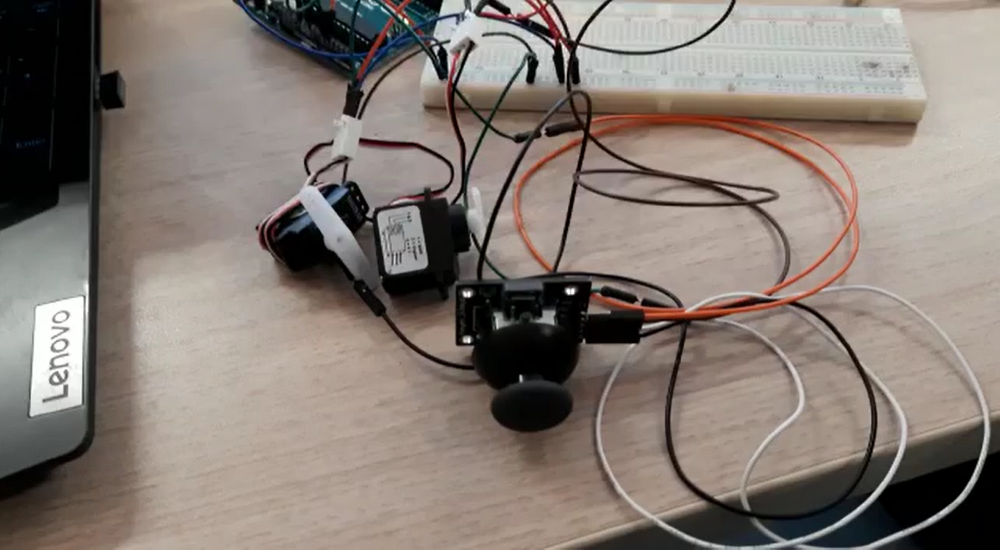
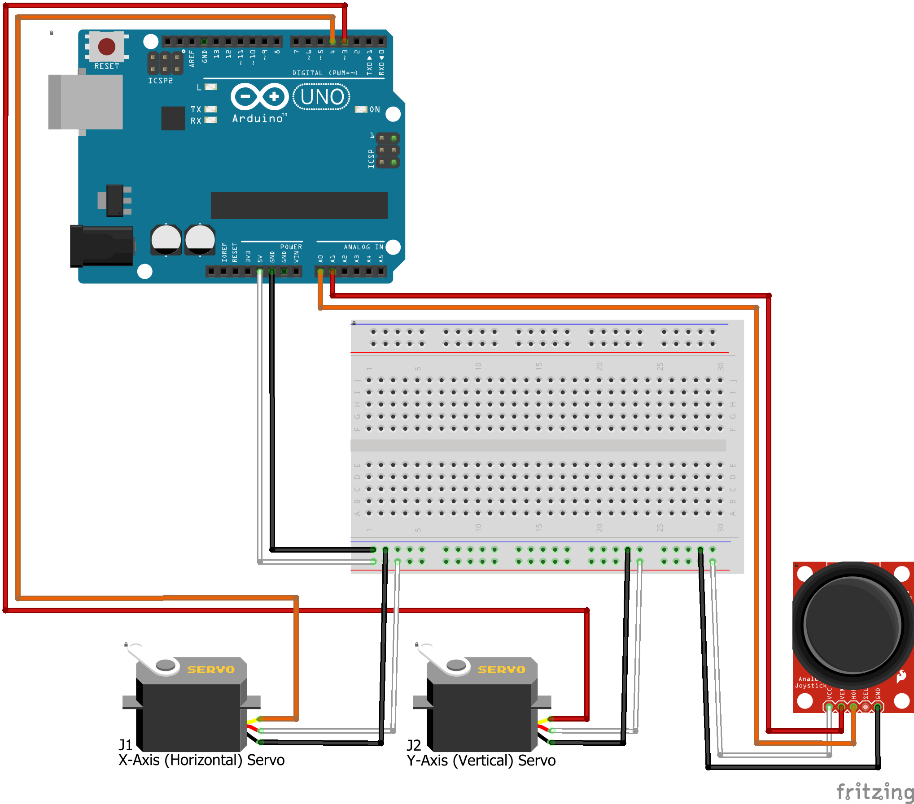

# Servo with Joystick

 

## Parts:
* Arduino (an Uno should be enough)
* A joystick
* 2 Servos (small enough that your arduino can power them both without an external power source)
* A breadboard (only if you want to see the wires better)

## Setup:
1. Attach the joystick
    1. `VCC` to 5v
    1. `GND` to ground
    1. `HOR` to an analogue input (default is 0)
    1. `VER` to an analogue input (default is 1)
1. Connect the servos
    1. red to 5v
    1. black/brown to ground
    1. yellow/orange
        * X-axis/horizontal into a digital input (default is 4)
        * Y-axis/vertical into a digital input (default is 3)
1. Change your settings in main.cpp
    * `YPINOUT` if you use a different pin for the vertical servo
    * `XPINOUT` if you use a different pin for the horizontal servo
1. Upload the program
1. Control the servos :)

### [Video](https://youtu.be/YO_YPF3o6Eg)

## Fritzing Sketch:

